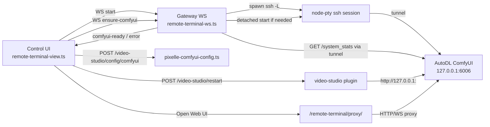

## User Requirements

用户希望将当前 `/yy-video/remote-servers/terminal` 的流程，从“远程终端 + 手动 ComfyUI 操作”改进为围绕原始需求展开的可执行方案：让 Pixelle-Video 能直接使用 AutoDL 服务器上的 ComfyUI 服务。

## Product Overview

页面应从单纯的 SSH 终端管理，升级为“远程 ComfyUI 算力接入面板”。用户添加或选择 AutoDL 服务器后，通过一个主操作完成连接、检查 ComfyUI、启动 ComfyUI、建立本地访问通道、写入 Pixelle 配置并重载 Pixelle，使 Pixelle-Video 能使用该远程 ComfyUI。

## Core Features

- 一键激活远程 AutoDL ComfyUI 给 Pixelle-Video 使用。
- 自动检查远端 ComfyUI 是否已启动，未启动时自动启动。
- 仅在 ComfyUI 可访问后自动写入 Pixelle 配置并重启/重载 Pixelle。
- 保留远程 Web UI 打开入口，用于人工调试或查看 ComfyUI 页面。
- 保留终端与手动重试入口，用于失败排查和兜底操作。
- 显示清晰状态：连接中、检查中、启动中、配置中、已就绪、失败。
- 避免多服务器切换时静默覆盖，明确展示当前 Pixelle 使用的远程端点。

## Tech Stack Selection

- 前端：沿用现有 Control UI 的 Lit + TypeScript 渲染方式，继续在 `ui/src/ui/views/remote-terminal-view.ts` 中演进，不引入 React/Vue。
- 样式：沿用现有 CSS 变量与 `ui/src/styles/remote-terminal.css`。
- 后端：沿用 Node.js + TypeScript 网关代码，复用 `src/gateway/remote-terminal-ws.ts` 的 WebSocket、PTY、SSH 隧道、代理机制。
- 测试：沿用 Vitest，覆盖网关协议、健康检查、UI 自动流程和失败分支。
- i18n：遵循 `ui/AGENTS.md`，只手动维护 `ui/src/i18n/locales/en.ts`，其他语言包与 `.i18n` 元数据通过同步命令生成。

## Implementation Approach

采用“分阶段、低风险”的方式落地，先不做大规模页面重构，而是在现有终端流程上增加一个后端驱动的 ComfyUI ensure 状态机，并让前端在健康检查成功后自动执行现有 Pixelle 配置写入与重启流程。

关键决策：

1. **先自动化核心链路，不先重写页面**

- 保留现有 SSH profile、Live terminal、Open remote service、Use for ComfyUI 能力。
- 将主流程升级为 `Activate for Pixelle`：连接 SSH → 建立隧道 → 检查 ComfyUI → 必要时启动 → 探活成功 → 写 Pixelle 配置 → 重启 Pixelle。

2. **新增后端 ComfyUI ensure 协议**

- 在 `src/gateway/remote-terminal-ws.ts` 中新增客户端消息类型，例如 `ensure-comfyui`。
- 后端基于已建立的 SSH 隧道访问 `http://127.0.0.1:<localPort>/system_stats`。
- 成功则发送 `comfyui-ready`；失败则通过 PTY 注入脱离终端的启动命令，再轮询健康检查。
- 不改变现有 `start/input/resize` 语义，保持协议向后兼容。

3. **ComfyUI 启动必须脱离终端**

- 当前快捷命令 `python main.py ...` 绑定前台 PTY，Disconnect 后可能中断。
- 新流程优先使用 `screen -dmS yyvideo-comfyui bash -lc '...'`，若 `screen` 不存在则 fallback 到 `nohup bash -lc '...' > /tmp/yyvideo-comfyui.log 2>&1 &`。
- 第一阶段使用 AutoDL 默认常量：`/root/autodl-tmp/ComfyUI`、`source /etc/network_turbo`、远端端口 6006，不开放任意用户命令，降低命令注入风险。

4. **Pixelle 写配置先由前端自动触发**

- 当前已有 `src/gateway/pixelle-comfyui-config.ts` 处理 `/video-studio/config/comfyui`，已有 `extensions/video-studio/index.ts` 处理 `/video-studio/restart`。
- 为避免 `src/gateway/remote-terminal-ws.ts` 直接依赖 video-studio 插件路由，第一阶段保持前端调用现有 HTTP 端点，但触发时机改为后端 `comfyui-ready` 之后。
- `Use for ComfyUI` 不删除，降级为 `Retry apply` 或高级兜底入口。

5. **Open remote service 不自动打开**

- 浏览器不允许从 WebSocket 异步回调可靠自动打开新标签页。
- 该功能保留为次要调试入口，文案改为 `Open Web UI`，继续通过现有代理 URL 打开。

## Performance and Reliability

- 健康检查为有界轮询：例如每 2 秒一次，最多 90 秒；时间复杂度 O(n)，n 为轮询次数，I/O 量固定且低。
- 每次请求设置短超时，避免卡住 WebSocket 消息循环。
- PTY 输出仍受前端 `MAX_TERMINAL_OUTPUT_LENGTH` 截断，避免无限增长。
- 只在 ComfyUI 健康检查成功后写 Pixelle 配置，避免把不可用 URL 写入 Pixelle。
- 失败状态必须结构化返回，区分 SSH 失败、ComfyUI 启动失败、健康检查超时、Pixelle 配置失败、Pixelle 重启失败。
- 日志不输出密码、私钥路径内容或完整认证 token。

## Implementation Notes

- `src/gateway/AGENTS.md` 要求网关测试避免重型启动；新增 helper 应尽量是纯函数或可注入 HTTP/PTY 依赖，便于单元测试。
- `ui/AGENTS.md` 要求不要手改非英文 locale；新增文案先改 `ui/src/i18n/locales/en.ts`，再通过 i18n 同步生成其他文件。
- 当前工作区已有大量未提交修改，实施时必须只修改本计划涉及文件，避免覆盖用户已有 WIP。
- 第一阶段不引入任意用户自定义启动命令；后续如增加 `cwd/launchCmd` 配置，必须先设计白名单、长度限制和 shell escaping。
- Web UI 打开入口继续使用新标签页，避免当前 SSH 页面被路由替换导致会话中断。
- 多 profile 场景下，前端至少展示当前激活的 profile；完整 active endpoint 持久化可作为第二阶段。

## Architecture Design

当前目标架构：



数据流：

1. 用户点击 profile 主操作。
2. 前端打开 WebSocket 并发送 `start`。
3. 网关启动 SSH PTY 与 `-L` 隧道，返回 `ready` 和 `localBindUrl/proxyUrl`。
4. 前端自动发送 `ensure-comfyui`。
5. 网关通过隧道探测 `/system_stats`；不通则注入 detached 启动命令并轮询。
6. 网关返回 `comfyui-ready`。
7. 前端自动调用现有 Pixelle 配置与重启端点。
8. UI 展示 `Ready · Pixelle is using this endpoint`，并保留 `Open Web UI`、`Show terminal`、`Retry apply`。

## Directory Structure

本次计划涉及以下文件：

```
src/
└── gateway/
    ├── remote-terminal-ws.ts
    │   # [MODIFY] 扩展远程终端 WebSocket 协议。
    │   # 新增 ensure-comfyui 消息解析、状态帧发送、与新 helper 的调用。
    │   # 保持 start/input/resize 兼容，继续管理 SSH PTY、隧道、代理 URL 和 cleanup。
    │
    ├── remote-comfyui-ensure.ts
    │   # [NEW] ComfyUI ensure helper。
    │   # 实现 loopback health check、detached 启动命令构建、轮询、超时与结构化结果。
    │   # 通过依赖注入隔离 HTTP 请求和 PTY 写入，便于测试。
    │
    ├── remote-comfyui-ensure.test.ts
    │   # [NEW] ensure helper 单元测试。
    │   # 覆盖已运行、未运行后启动成功、启动超时、命令构建安全性、轮询停止。
    │
    ├── remote-terminal-ws.test.ts
    │   # [MODIFY] 增加 WS 协议测试。
    │   # 覆盖 ensure-comfyui 需要已 start、ready 后可触发、成功/失败帧结构。
    │
    └── remote-terminal-ws.password.test.ts
        # [AFFECTED] 确认密码登录 prompt 行为未被 ensure 流程破坏；必要时补充回归断言。

ui/
└── src/
    ├── ui/views/
    │   ├── remote-terminal-view.ts
    │   │   # [MODIFY] 将 Connect 主流程升级为 Activate for Pixelle。
    │   │   # ready 后自动发送 ensure-comfyui，comfyui-ready 后自动调用 Pixelle 配置与重启。
    │   │   # 保留 Open Web UI、终端、快捷命令和手动 Retry apply 兜底。
    │   │
    │   └── remote-terminal-view.test.ts
    │       # [MODIFY] 覆盖自动 ensure、自动应用 Pixelle、失败状态、Open Web UI 仍保留。
    │
    ├── styles/
    │   └── remote-terminal.css
    │       # [MODIFY] 增加激活状态条、阶段 badge、次要操作和失败提示样式。
    │
    └── i18n/
        ├── locales/en.ts
        │   # [MODIFY] 新增 Activate、checking、starting、applying、ready、retry、Open Web UI 等英文文案。
        │
        ├── locales/de.ts
        ├── locales/es.ts
        ├── locales/fr.ts
        ├── locales/id.ts
        ├── locales/ja-JP.ts
        ├── locales/ko.ts
        ├── locales/pl.ts
        ├── locales/pt-BR.ts
        ├── locales/th.ts
        ├── locales/tr.ts
        ├── locales/uk.ts
        ├── locales/zh-CN.ts
        └── locales/zh-TW.ts
            # [GENERATED MODIFY] 通过 pnpm ui:i18n:sync 生成，不手动翻译。

        .i18n/
        ├── de.meta.json
        ├── es.meta.json
        ├── fr.meta.json
        ├── id.meta.json
        ├── ja-JP.meta.json
        ├── ko.meta.json
        ├── pl.meta.json
        ├── pt-BR.meta.json
        ├── th.meta.json
        ├── tr.meta.json
        ├── uk.meta.json
        ├── zh-CN.meta.json
        └── zh-TW.meta.json
            # [GENERATED MODIFY] i18n 同步后的元数据。
```

## Key Code Structures

建议新增/调整的协议结构：

```ts
type RemoteTerminalEnsureComfyUiMessage = {
  type: "ensure-comfyui";
};

type RemoteTerminalServerMessage =
  | { type: "status"; message: string }
  | { type: "data"; data: string }
  | { type: "ready"; service?: RemoteTerminalServiceInfo }
  | {
      type: "comfyui-status";
      phase: "checking" | "starting" | "waiting" | "ready" | "failed";
      message: string;
    }
  | {
      type: "comfyui-ready";
      service: RemoteTerminalServiceInfo;
      healthUrl: string;
    }
  | {
      type: "comfyui-error";
      phase: "checking" | "starting" | "waiting";
      message: string;
    };
```

建议新增 helper 输入输出：

```ts
type EnsureComfyUiParams = {
  localPort: number;
  servicePort: number;
  writePty: (data: string) => void;
  onStatus: (phase: string, message: string) => void;
  signal?: AbortSignal;
};

type EnsureComfyUiResult =
  | { ok: true; alreadyRunning: boolean; healthUrl: string }
  | { ok: false; phase: string; message: string };
```

## Verification Plan

- 聚焦测试：
- `pnpm test src/gateway/remote-comfyui-ensure.test.ts src/gateway/remote-terminal-ws.test.ts src/gateway/remote-terminal-ws.password.test.ts ui/src/ui/views/remote-terminal-view.test.ts`
- i18n 同步：
- `pnpm ui:i18n:sync`
- 变更面验证：
- `pnpm check:changed`
- 若修改动态加载或网关边界：
- `pnpm build`

## Design Approach

页面保留现有深色控制台风格，但主心智从“终端页面”调整为“远程 ComfyUI 接入面板”。

核心页面仍为单页桌面控制台布局，沿用现有左侧导航和顶部应用框架，不新增底部导航。页面上方的服务器卡片突出一个主操作：`Activate for Pixelle`。激活后卡片展示阶段状态，例如 `Connecting`、`Checking ComfyUI`、`Starting ComfyUI`、`Applying to Pixelle`、`Ready`。`Open Web UI` 和 `Show terminal` 作为次要调试入口，避免抢占主流程。

## Page Blocks

1. **Endpoint/Profile Cards**

- 显示服务器名称、SSH 地址、远端服务端口、最近使用时间、当前是否被 Pixelle 使用。
- 主按钮为 `Activate for Pixelle`，已激活时显示 `Ready` 和 `Stop/Disconnect`。

2. **Activation Status Strip**

- 用水平阶段条展示连接、探活、启动、写配置、重启 Pixelle 的进度。
- 失败时直接显示失败阶段与重试按钮。

3. **Secondary Debug Actions**

- `Open Web UI` 作为次要按钮打开 ComfyUI 页面。
- `Retry apply` 用于自动配置失败后的手动重试。

4. **Advanced Terminal**

- Live terminal 默认保留在当前页面下方，可后续折叠。
- 快捷命令继续保留，作为自动启动失败时的人工兜底。

视觉效果保持专业、清晰、低干扰：成功状态使用绿色描边与 badge，进行中使用蓝色/黄色状态提示，失败使用红色 callout。整体不做华丽动效，重点是可靠的操作反馈。

## Agent Extensions

### SubAgent

- **code-explorer**
- Purpose: 在实施前复核跨文件边界，包括远程终端 WebSocket、Pixelle 配置端点、video-studio restart 路由、UI i18n 与测试布局。
- Expected outcome: 明确最终修改点，避免引入 core 与 plugin 的不必要耦合，并确认测试覆盖路径。
